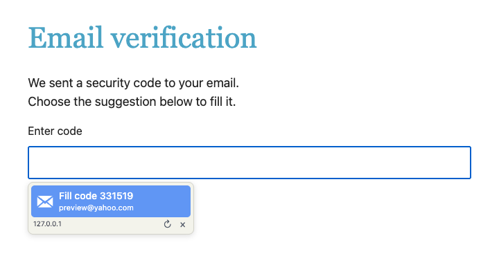

# Mail Verify

[](https://github.com/MrLawrenceAwe/Mail-Verify/actions/workflows/ci.yml)

Find email verification codes, account confirmation links, and password reset links in Yahoo inboxes from desktop Chrome on macOS. Click a result to fill a code, open a confirmation link, or copy a reset link. No webmail tab is needed. Yahoo is currently the only supported provider.



*Local preview with a synthetic email and verification code; no real inbox is accessed.*

## Engineering highlights

- Connects a Chrome extension to a Python companion through native messaging.
- Uses macOS Keychain for credentials and read-only IMAP checks for Yahoo mail.
- Extracts codes and links locally, with freshness filtering and bounded page inspection.
- Automated Python and JavaScript suites use synthetic mail and fake browser/IMAP connections.

For a preview without an inbox, serve the repository with `python3 -m http.server 8767 --bind 127.0.0.1` and open `/docs/preview.html`. This renders the real suggestion interface with synthetic mail.

## Quick setup

Requires macOS, desktop Chrome, Python 3.9+ and a Yahoo-generated app password.

1. Run **Install Companion.command** from the project folder.
2. Load the `extension` folder through Chrome's **Load unpacked** control.
3. Pin Mail Verify, open its popup and add your Yahoo account.
4. Request a verification email on a website, then select the matching suggestion.

See [setup, updates and removal](docs/setup.md) and [the usage guide](docs/usage.md). Check the sender and destination before using a suggestion; this tool does not authenticate senders or match results to the current website.

## Privacy and permissions

Your Mac connects directly to `imap.mail.yahoo.com:993` over TLS. Credentials are stored in macOS Keychain under `local.yahoo_code_fill`, never in extension storage, configuration files, logs, or command-line arguments. Checks use a read-only inbox and `BODY.PEEK`, so they do not mark messages read.

The extension uses `nativeMessaging`, `activeTab`, `scripting`, and `clipboardWrite`, and runs a content script on HTTPS pages. On-page controls use an isolated content-script context and closed shadow roots. Results are held temporarily in memory. When you select a code to fill, the website can read that code. There are no analytics or AI integrations.

Chrome starts the companion on demand. No background login item, public server, or network listener is installed. Native messaging is restricted to this extension’s identity.

## Development and tests

Requires Node.js 22+ and Python 3.9+ for the automated checks:

```sh
npm test
```

CI runs both suites on macOS. Tests do not require Yahoo credentials or access Keychain. See [the developer guide](docs/development.md) for architecture and [testing and previews](docs/testing.md) for synthetic fixtures and checks requiring a real inbox.

## References

- [Chrome native messaging](https://developer.chrome.com/docs/extensions/develop/concepts/native-messaging)
- [Yahoo IMAP access](https://help.yahoo.com/kb/SLN28681.html)
